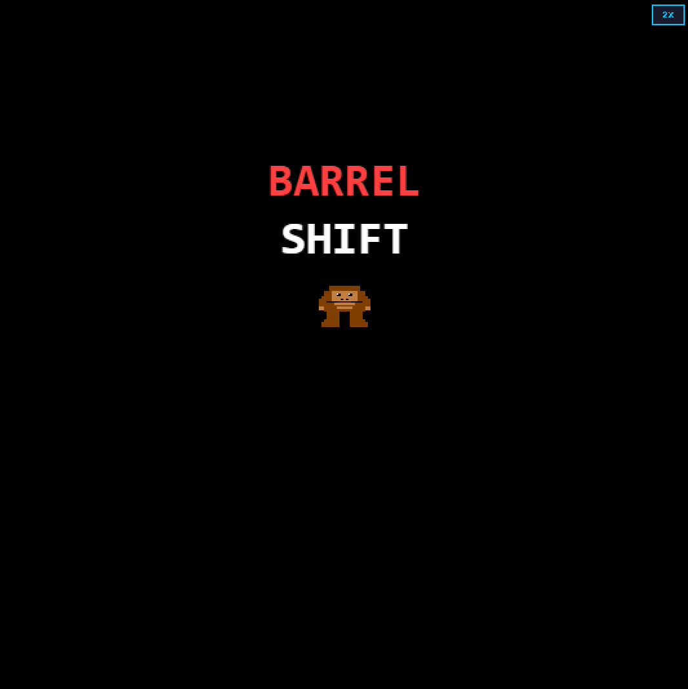

## Barrel Shift

Barrel Shift is a small homage to the classic Donkey Kong arcade game, built in plain HTML5 Canvas and vanilla JavaScript. Everything on screen is drawn procedurally (no sprite sheets or external assets) and the game logic is implemented from scratch.

### Gameplay

You control a familiar-looking plumber climbing girders, dodging and smashing barrels, and trying to reach Pauline at the top of the construction site.

Key features:
- Fixed‑timestep engine running at 60 FPS
- Sloped platforms and simple platformer physics (gravity, jumping, falling)
- Ladders (including broken ladders you can’t climb)
- Rolling barrels that can choose to drop down ladders
- Hammer power‑up to smash barrels for extra points
- Title, win, and game‑over screens with basic HUD (score, lives, level)
- Pixel‑art sprites rendered with `fillRect` using a retro colour palette

### Controls

Keyboard:
- Left / Right Arrows – Walk
- Up / Down Arrows   – Climb ladders
- Space               – Jump
- Enter               – Start / continue from title and win/game‑over screens

On‑screen button:
- **2x / 1x** button in the top‑right toggles the canvas scale while preserving crisp pixel art.

### Running the Game

The game is a static web page; no build step is required.

1. Clone or download this repository.
2. Open `index.html` in a modern browser **via a local web server** (recommended):
	 - If you use VS Code, the *Live Server* extension works well.
	 - Or from this folder run, for example:
		 - `npx serve .`
		 - then open the printed `http://localhost:…` URL in your browser.

Opening `index.html` directly from the filesystem may work, but some browsers restrict scripts or audio when loaded from `file://` URLs.

### Project Structure

- [index.html](index.html) – Bootstrap page, canvas element, scale toggle button, and the main game loop wiring.
- [js/config.js](js/config.js) – Global `DK` namespace, configuration constants, enums, colour palette, and the canonical `GameState` shape shared by engine and renderer.
- [js/engine.js](js/engine.js) – Core game logic: input handling, physics, collisions, barrel spawning and behaviour, screen transitions, and level management.
- [js/renderer.js](js/renderer.js) – Pixel‑art renderer and HUD: draws all entities and UI based on the immutable `GameState`, plus basic audio hooks.

### Tech Notes

- Written in plain JavaScript; no frameworks or bundlers.
- Uses HTML5 Canvas 2D context only; sprites are drawn by code.
- Engine and renderer are deliberately decoupled and communicate only via the `GameState` structure defined in `config.js`.

Feel free to fork and extend the game with additional levels, enemy types, sounds, or visual polish.
